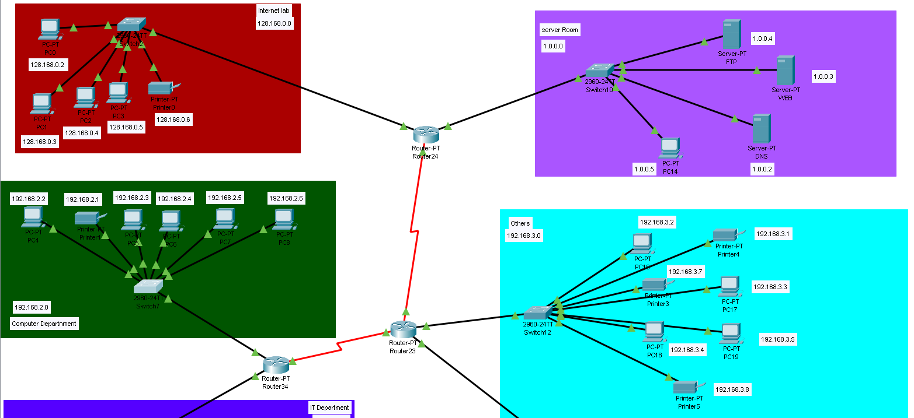
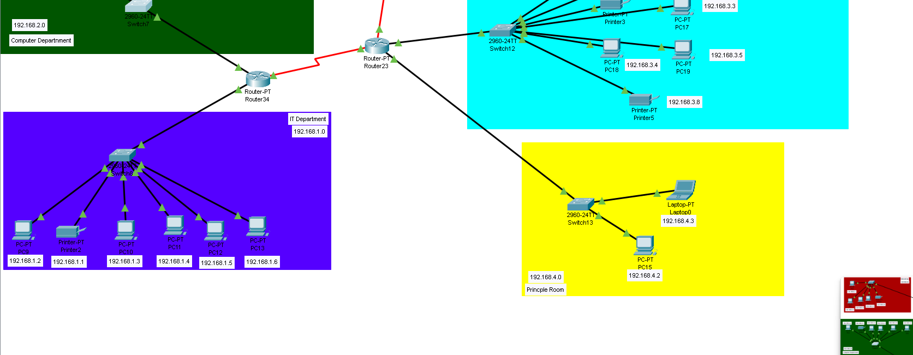

# Multi-Department Enterprise Network Simulation

A Cisco Packet Tracer project simulating a small enterprise network with six segmented departments, three interconnecting routers, centralized network services, and full IP addressing across multiple subnets.

---

## 🗺️ Network Topology

The network is built around a **three-router backbone** (Router24, Router23, Router34), connected to each other via serial WAN links (shown in red). Each router acts as the gateway for two local department LANs, with access-layer switches distributing connectivity to end devices within each zone.

---

## 🏢 Departments & IP Addressing

| Zone / Department | Subnet | Access Switch | Gateway Router | Connected Devices |
|---|---|---|---|---|
| **Internet Lab** | `128.168.0.0/24` | Switch2 | Router24 | PC0, PC1, PC2, PC3, Printer0 |
| **Server Room** | `1.0.0.0/24` | Switch10 | Router24 | FTP Server, Web Server, DNS Server, PC14 |
| **Computer Department** | `192.168.2.0/24` | Switch7 | Router34 | PC4, PC5, PC6, PC7, PC8, Printer1 |
| **IT Department** | `192.168.1.0/24` | Switch9 | Router34 | PC9, PC10, PC11, PC12, PC13, Printer2 |
| **Others** | `192.168.3.0/24` | Switch12 | Router23 | PC16, PC17, PC18, PC19, Printer3, Printer4, Printer5 |
| **Principle Room** | `192.168.4.0/24` | Switch13 | Router23 | PC15, Laptop0 |

---

## 🔗 Backbone Design

- **Router24** connects the *Internet Lab* and *Server Room* segments, and links to Router23 via a serial WAN connection.
- **Router23** sits at the center of the backbone, connecting to both Router24 and Router34, and serves the *Others* and *Principle Room* segments.
- **Router34** connects the *Computer Department* and *IT Department* segments, linking back to Router23.

This hub-style router chain allows any department to reach the centralized Server Room (DNS, Web, FTP) or the Internet Lab regardless of which router they sit behind.

---

## 🖥️ Device Summary

| Device Type | Count |
|---|---|
| Routers | 3 |
| Switches (2960-24TT) | 6 |
| PCs | 20 (PC0–PC19) |
| Printers | 6 |
| Laptops | 1 |
| Servers | 3 (DNS, Web, FTP) |

---

## ⚙️ Configured Services

- **DNS Server** (`1.0.0.2`) — name resolution for the network
- **Web Server** (`1.0.0.3`) — hosts HTTP content, reachable across departments
- **FTP Server** (`1.0.0.4`) — file transfer service for the network
- Centralized in the **Server Room** so all departments can reach shared services through the router backbone

---

## 🛠️ Tools Used

- **Cisco Packet Tracer** — network design, device configuration, and simulation

---

## 📂 Repository Contents

- `project.pkt` — the full Packet Tracer project file
- `images/` — topology screenshots for quick reference without opening the software

---

## ▶️ How to Open

This project requires **Cisco Packet Tracer** (free with a [Cisco Networking Academy](https://www.netacad.com/) account) to open and run `project.pkt`.
